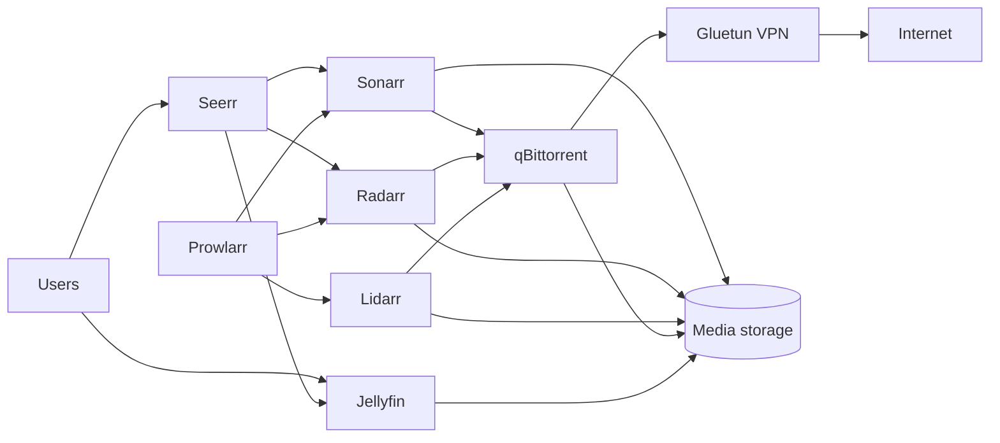

# Jellyfin Media Stack for Proxmox VE

One guided installer deploys a complete Jellyfin media stack into a Debian LXC
on Proxmox VE. It creates the container, configures onboard or NFS media
storage, installs Docker, passes through a supported GPU, starts the services,
and wires the applications together.

The default install is interactive and portable. It detects the current
Proxmox host instead of assuming a particular storage pool, VLAN, DNS server,
NAS address, container ID, or GPU.

## Contents

- [What gets installed](#what-gets-installed)
- [How the stack fits together](#how-the-stack-fits-together)
- [Requirements](#requirements)
- [Quick start](#quick-start)
- [Installer modes](#installer-modes)
- [Storage choices](#storage-choices)
- [Network and DNS](#network-and-dns)
- [GPU transcoding](#gpu-transcoding)
- [VPN requirement](#vpn-requirement)
- [Logins and passwords](#logins-and-passwords)
- [Ports](#ports)
- [What is configured automatically](#what-is-configured-automatically)
- [Command-line reference](#command-line-reference)
- [After installation](#after-installation)
- [Updating, stopping, and restarting](#updating-stopping-and-restarting)
- [Backups and removal](#backups-and-removal)
- [Troubleshooting](#troubleshooting)
- [Repository layout](#repository-layout)
- [Development and releases](#development-and-releases)
- [Security notes](#security-notes)

## What gets installed

| Category | Application | Purpose |
|---|---|---|
| Media | Jellyfin | Streams and manages the media libraries |
| Requests | Seerr/Jellyseerr | User requests for movies and TV |
| Automation | Sonarr | TV and anime management |
| Automation | Radarr | Movie management |
| Automation | Lidarr | Music management |
| Indexers | Prowlarr | Indexer management and application sync |
| Subtitles | Bazarr | Subtitle discovery and management |
| Downloads | qBittorrent | Torrent download client |
| VPN | Gluetun | Routes qBittorrent traffic through the VPN |
| Quality | Profilarr | GUI for TRaSH Guides profiles and custom formats |
| Quality | Recyclarr | Applies and refreshes the included TRaSH baseline |
| Books/comics | Kavita | Ebook and comic reader |
| Books/comics | Mylar | Comic download automation |
| Indexer helper | Byparr | Browser-challenge helper for compatible indexers |
| Statistics | Jellystat | Jellyfin statistics, backed by internal PostgreSQL |
| Invitations | Wizarr | User invitation and onboarding portal |
| Dashboard | Media Stack Home | Simple links page for every web application |
| Dashboard | Homarr | Customizable homelab dashboard |
| Management | Portainer | Docker management UI |

The first page to open after installation is Media Stack Home:

```text
http://<LXC-IP>:8088
```

## How the stack fits together



Only qBittorrent is forced through Gluetun. The other applications retain
normal LAN access so they can communicate with one another and with Jellyfin.

## Requirements

Run the installer as `root` directly on a Proxmox VE host.

You need:

- A working Proxmox VE installation with `pct`, `pveam`, and `pvesm`
- An active storage pool that supports LXC root disks
- An active storage pool that supports container templates
- DHCP on the selected network, or a valid static IPv4 configuration
- Working outbound DNS, HTTP, and HTTPS from the new LXC
- Either:
  - free Proxmox storage for an onboard media disk, or
  - a reachable NFS export for primary media storage
- NordVPN manual-service credentials for Gluetun/qBittorrent downloads. The
  core applications can be installed and configured before these are added.
- Optional NVIDIA or AMD GPU already visible to the Proxmox host

Recommended starting resources are the installer defaults:

| Resource | Default |
|---|---:|
| Root disk | 32 GB |
| CPU | 2 cores |
| Memory | 8000 MB |
| Swap | 512 MB |
| Media disk in onboard mode | Up to 100 GB, adjustable |

Large libraries, metadata-heavy installations, and transcoding workloads may
need more disk, CPU, or memory.

### Firewall access

The LXC needs outbound access to:

- DNS: TCP/UDP `53`
- HTTP: TCP `80`
- HTTPS: TCP `443`
- NFS server: TCP `2049` when NFS storage is selected

Allow inbound application ports only from trusted LANs or through a properly
secured reverse proxy. The complete port table is below.

## Quick start

Run the public, checksum-pinned bootstrap on the Proxmox host:

```bash
bash -c "$(curl -fsSL https://cloud.masternazz.com/s/ddfie8QwGyZp9Hi/download)"
```

This is the easiest installation method. The bootstrap downloads the release
bundle, verifies its SHA-256 checksum, and opens the guided installer.

To use the repository directly:

```bash
git clone https://github.com/masternazz/nazz-media-stack.git
cd nazz-media-stack
chmod +x install-jellyfin-stack.sh
./install-jellyfin-stack.sh
```

This repository is currently private. Cloning it or downloading `install.sh`
from `raw.githubusercontent.com` requires GitHub access to the repository. The
public bootstrap above does not require GitHub authentication.

### Before pressing Install

Confirm the installation plan shown on screen, especially:

- CTID and hostname
- root and template storage pools
- onboard versus NFS media storage
- bridge, VLAN, IP configuration, and DNS
- selected GPU mode
- whether an existing CTID will be replaced

`--replace` destroys the existing container before creating the new one. If
that container owns an onboard media volume, its media data is destroyed too.

### Repair an existing blank/default install

Do not destroy or reinstall the LXC. From a repository checkout on the Proxmox
host, run:

```bash
chmod +x repair-existing.sh
./repair-existing.sh <CTID>
```

The repair updates only the stack's compose/setup assets, preserves `.env`,
application databases, configs, and media, then initializes the logins,
libraries, application connections, Portainer environment, and Homarr
dashboard. If VPN credentials are still placeholders, it repairs the core apps
and prints the one command needed to finish downloads later.

## Installer modes

Running the script without flags opens the Proxmox-style terminal UI.

### Default Settings

Uses detected Proxmox values and asks only for the settings needed to complete
the deployment:

- primary media storage: onboard or NFS
- optional second NFS share
- network/VLAN choice
- GPU choice
- NordVPN manual credentials
- shared application login

### Default Settings (verbose)

Uses the same guided questions while showing command output live.

### Advanced Settings

Allows editing the CTID, hostname, storage pools, resources, template, network,
storage paths, GPU, and application behavior.

### Unattended

Use `--no-gui` and provide all required values through flags and environment
variables:

```bash
NORDVPN_USER='manual-service-user' \
NORDVPN_PASS='manual-service-password' \
MEDIASTACK_ADMIN_USER='admin' \
MEDIASTACK_ADMIN_PASSWORD='use-a-long-unique-password' \
./install-jellyfin-stack.sh --no-gui \
  --nas-export 192.168.1.10:/volume1/media \
  --gpu off
```

Onboard example:

```bash
NORDVPN_USER='manual-service-user' \
NORDVPN_PASS='manual-service-password' \
MEDIASTACK_ADMIN_PASSWORD='use-a-long-unique-password' \
./install-jellyfin-stack.sh --no-gui \
  --media-storage local \
  --local-media-storage local-lvm \
  --local-media-size 250 \
  --gpu auto
```

The unattended default media mode is NFS. Explicitly pass
`--media-storage local` for an onboard disk.

### Limited or broken terminal

The installer normally reattaches to the controlling terminal even when the
bootstrap is piped into Bash. If the terminal UI is still unusable, run the
plain-text path:

```bash
TERM=dumb bash -c "$(curl -fsSL https://cloud.masternazz.com/s/ddfie8QwGyZp9Hi/download)"
```

Use arrow keys to move, Space to select checklist items, Tab to change buttons,
and Enter to confirm.

## Storage choices

Every application sees primary storage at `/mnt/nas`, regardless of the
selected backend. This keeps all container paths consistent.

### Onboard Proxmox storage

Onboard mode creates a separate Proxmox-managed volume and attaches it to the
LXC as `mp0` at `/mnt/nas`.

- The guided installer selects the active compatible pool with the most free
  space.
- You can change the pool and size before installation.
- This is easy for a single Proxmox host and requires no NAS.
- The media volume belongs to the LXC configuration.

> **Data-loss warning:** replacing or destroying the LXC also destroys its
> Proxmox-managed onboard media volume. Keep tested backups outside this
> container before using `--replace` or `pct destroy`.

### Primary NFS storage

NFS mode mounts the export on the Proxmox host and bind-mounts it into the LXC
at `/mnt/nas`.

Example export:

```text
192.168.1.10:/volume1/media
```

The host mount defaults to `/mnt/jellyfin-media`. The installer persists the
mount in the Proxmox host's `/etc/fstab`.

The NFS server must allow the Proxmox host, support the required ownership and
permissions, and be reachable from the selected network.

### Optional secondary NFS storage

Enable the second share in the UI or use:

```bash
--enable-qnap \
--qnap-export 192.168.1.20:/Multimedia
```

It is mounted at `/mnt/qnap` in the LXC. The name "QNAP" is only a label; the
secondary share may come from any compatible NFS server.

### Created media folders

Automatic configuration creates:

```text
/mnt/nas/
├── jellyfin-cache/
├── media/
│   ├── anime/
│   ├── books/
│   ├── comics/
│   ├── movies/
│   ├── music/
│   └── tv/
└── torrents/
    ├── anime/
    ├── books/
    ├── comics/
    ├── incomplete/
    ├── movies/
    ├── music/
    └── tv/
```

Use the paths configured by the installer inside the applications. Do not mix
host paths, LXC paths, and Docker container paths.

## Network and DNS

The network defaults are:

| Setting | Default |
|---|---|
| Bridge | `vmbr0` |
| VLAN | Untagged |
| IP | DHCP |
| DNS | First usable non-loopback resolver detected on Proxmox |
| Timezone | Proxmox host timezone |

For a tagged network, choose the same working application VLAN used by similar
containers. The VLAN must have DHCP or use a valid static address.

Static-IP example:

```bash
--ip-config 192.168.1.50/24,gw=192.168.1.1
```

DNS must be an address the LXC can reach. Do not use a loopback-only resolver
such as `127.0.0.1` or `127.0.0.53`.

Before package installation, the script waits for LXC startup, validates IPv4
DNS, and checks Debian repository connectivity. APT operations retry on
transient failure. The installer also gives APT's sandbox user permission to
read the generated resolver configuration inside unprivileged LXCs.

## GPU transcoding

GPU mode defaults to `auto`.

- NVIDIA is preferred when both NVIDIA and AMD are present.
- NVIDIA passes through the detected GPU devices and installs a matching
  userspace driver inside the LXC.
- AMD passes through `/dev/dri` and enables VAAPI.
- `off` leaves Jellyfin in CPU-only mode.

Force a mode:

```bash
./install-jellyfin-stack.sh --gpu nvidia
./install-jellyfin-stack.sh --gpu amd
./install-jellyfin-stack.sh --gpu off
```

Use `--require-nvidia` or `--require-amd` when the install must fail instead of
continuing without the requested hardware.

After installation:

```bash
pct exec <CTID> -- nvidia-smi
```

or:

```bash
pct exec <CTID> -- vainfo --display drm --device /dev/dri/renderD128
```

GPU passthrough only makes the device available. Select the appropriate
hardware acceleration method in Jellyfin's playback/transcoding settings if it
is not already enabled for the desired codecs.

## VPN requirement

qBittorrent shares Gluetun's network namespace and cannot bypass it.

The default compose file expects **NordVPN manual-service credentials**. These
are not necessarily the same as the email address and password used to sign in
to the NordVPN website. Obtain the manual setup/service credentials from the
VPN provider.

If you answer **No** when the installer asks for VPN credentials:

- the LXC, Docker, compose files, and environment file are installed;
- `NORDVPN_USER` and `NORDVPN_PASS` remain `CHANGE_ME`;
- Jellyfin, Portainer, Homarr, the Arr applications, Seerr, and the other core
  services are started and configured;
- Gluetun and qBittorrent remain stopped;
- the Arr download-client connections remain pending.

Jellyfin and the core applications are usable in this state, but automated
downloads are intentionally disabled. To finish the download setup:

```bash
pct enter <CTID>
nano /opt/mediastack/.env
```

Replace both VPN `CHANGE_ME` values, exit the LXC, and confirm them:

```bash
pct exec <CTID> -- grep -E '^NORDVPN_(USER|PASS)=' /opt/mediastack/.env
```

Then run the installed finisher:

```bash
pct exec <CTID> -- /usr/local/sbin/mediastack-finish-setup
```

It starts Gluetun/qBittorrent, creates qBittorrent categories, connects the Arr
download clients, reapplies the selected setup, and verifies the complete
installation. The installer stores the secondary-storage, TRaSH, and subtitle
timer choices in `.env`, so they do not need to be re-entered.

Other Gluetun-supported providers can be used by editing the VPN variables and
compose configuration, but the guided installer currently collects NordVPN
credentials.

## Logins and passwords

The guided installer asks for one shared password and confirms it once.

| Destination | Username | Password |
|---|---|---|
| LXC console | `root` | Shared password, unless `--root-password` was supplied |
| Jellyfin | Chosen shared admin user, default `admin` | Shared password |
| qBittorrent | Chosen shared admin user, default `admin` | Shared password |
| Profilarr | Chosen shared admin user, default `admin` | Shared password |
| Homarr | Chosen shared admin user, normalized to lowercase | Shared password |
| Portainer | Chosen shared admin user, default `admin` | Shared password |

The LXC console and the Jellyfin web page are different login systems. Use
`root` for `pct enter`, the Proxmox console, or SSH. Use the application admin
username for Jellyfin.

Sonarr, Radarr, Lidarr, Prowlarr, Bazarr, Seerr, and the other services
do not all use this shared login. Their inter-application API keys are created
and configured automatically where supported; configure additional UI
authentication inside each app before exposing it beyond the trusted LAN.

The generated environment file is:

```text
/opt/mediastack/.env
```

It is readable only by root (`0600`). To display the recorded shared login from
the Proxmox host:

```bash
pct exec <CTID> -- bash -lc \
  'grep -E "^(MEDIASTACK_ADMIN_USER|MEDIASTACK_ADMIN_PASSWORD)=" /opt/mediastack/.env'
```

This prints the password on screen. Clear the terminal and protect shell logs
afterward.

For unattended installs, set:

```bash
MEDIASTACK_ADMIN_USER='admin'
MEDIASTACK_ADMIN_PASSWORD='at-least-12-characters'
```

For reliable `.env` parsing, the installer accepts letters, numbers, and
`. _ @ % + = : , ! ~ / -` in the shared password.

Set a different Linux root password with:

```bash
--root-password 'a-different-root-password'
```

## Ports

Replace `<LXC-IP>` with the address returned by:

```bash
pct exec <CTID> -- hostname -I
```

| Application | URL/port | Notes |
|---|---:|---|
| Media Stack Home | `http://<LXC-IP>:8088` | Recommended starting page |
| Jellyfin | `http://<LXC-IP>:8096` | Media server |
| Seerr/Jellyseerr | `http://<LXC-IP>:5055` | Requests |
| Jellystat | `http://<LXC-IP>:3000` | Statistics |
| Wizarr | `http://<LXC-IP>:5690` | Invitations |
| Sonarr | `http://<LXC-IP>:8989` | TV/anime |
| Radarr | `http://<LXC-IP>:7878` | Movies |
| Lidarr | `http://<LXC-IP>:8686` | Music |
| Prowlarr | `http://<LXC-IP>:9696` | Indexers |
| Bazarr | `http://<LXC-IP>:6767` | Subtitles |
| qBittorrent | `http://<LXC-IP>:8080` | Published through Gluetun |
| Profilarr | `http://<LXC-IP>:6868` | TRaSH Guides GUI |
| Kavita | `http://<LXC-IP>:5000` | Books/comics |
| Mylar | `http://<LXC-IP>:8090` | Comics automation |
| Byparr | `http://<LXC-IP>:8191` | Indexer helper/API |
| Homarr | `http://<LXC-IP>:7575` | Dashboard |
| Portainer | `https://<LXC-IP>:9443` | HTTPS; a browser certificate warning is expected initially |

Additional published ports:

| Port | Protocol | Purpose |
|---:|---|---|
| `6881` | TCP and UDP | qBittorrent incoming peer traffic through Gluetun |
| `8000` | TCP | Portainer Edge Agent tunnel; not the normal Portainer web UI |

PostgreSQL for Jellystat is internal-only and is not published on the LXC.
Recyclarr is a scheduled command-line service and has no web port.

## What is configured automatically

When automatic configuration is enabled, the installer:

- creates the shared media and download directory tree;
- applies the shared login to Jellyfin, qBittorrent, Profilarr, Homarr, and
  Portainer;
- creates a populated Homarr dashboard with links to the media applications;
- creates Portainer's admin account and local Docker environment;
- creates qBittorrent categories and matching save paths;
- connects Sonarr, Radarr, and Lidarr to qBittorrent;
- creates their root folders;
- connects Prowlarr to Sonarr, Radarr, and Lidarr;
- connects Bazarr to Sonarr and Radarr;
- creates Jellyfin libraries for movies, TV, anime, music, and books;
- initializes Seerr against Jellyfin, Sonarr, and Radarr;
- connects Profilarr to Sonarr and Radarr and links its TRaSH database;
- applies the included Recyclarr baseline:
  - Sonarr `WEB-1080p`
  - Radarr `HD Bluray + WEB`
- enables daily Recyclarr synchronization;
- installs a safe weekly subtitle repair timer unless disabled.

Use `--no-auto-configure` if you want the containers started without this
first-run wiring. Use `--no-trash-profiles` to keep the application wiring but
skip the initial Recyclarr profile sync.

## Command-line reference

Run the authoritative built-in help at any time:

```bash
./install-jellyfin-stack.sh --help
```

### Container and network

| Option | Meaning | Default |
|---|---|---|
| `--ctid ID` | Container ID, `auto`, or `next` | Next free ID |
| `--nextid` | Select the next free Proxmox ID | Enabled by default |
| `--hostname NAME` | LXC hostname | `jellyfin` |
| `--storage NAME` | Root-disk storage | Auto-detected active `rootdir` pool |
| `--template-storage NAME` | Template storage | Auto-detected active `vztmpl` pool |
| `--disk-gb GB` | Root-disk size | `32` |
| `--cores COUNT` | CPU cores | `2` |
| `--memory-mb MB` | Memory | `8000` |
| `--swap-mb MB` | Swap | `512` |
| `--template REF` | Proxmox template reference or `auto` | Debian 13, fallback Debian 12 |
| `--bridge NAME` | Proxmox bridge | `vmbr0` |
| `--vlan ID` | VLAN tag | Untagged |
| `--ip-config VALUE` | `ip=` value: DHCP or static CIDR/gateway | `dhcp` |
| `--nameserver IP` | LXC resolver | Auto-detected usable resolver |
| `--timezone ZONE` | IANA timezone | Proxmox host timezone |

### Storage

| Option | Meaning | Default |
|---|---|---|
| `--media-storage nfs\|local` | Primary media backend | NFS unattended; prompted in UI |
| `--local-media-storage ID` | Pool for onboard media disk | Compatible pool with most free space |
| `--local-media-size GB` | Onboard media volume size | Fits free space, maximum 100 GB |
| `--nas-export EXPORT` | Primary NFS export | Required in NFS mode |
| `--host-nas PATH` | Primary host mount path | `/mnt/jellyfin-media` |
| `--enable-qnap` | Enable secondary NFS mount | Disabled |
| `--qnap-export EXPORT` | Secondary NFS export | Required with `--enable-qnap` |
| `--host-qnap PATH` | Secondary host mount path | `/mnt/jellyfin-media-secondary` |

### GPU

| Option | Meaning |
|---|---|
| `--gpu auto\|nvidia\|amd\|off` | Select passthrough mode |
| `--no-gpu` | CPU-only alias for `--gpu off` |
| `--require-nvidia` | Require NVIDIA or fail |
| `--require-amd` | Require AMD or fail |
| `--no-nvidia` | Deprecated alias for `--no-gpu` |

### Stack and credentials

| Option | Meaning |
|---|---|
| `--env-file FILE` | Use an existing `.env`; generate missing secrets |
| `--no-start` | Install the LXC and files without starting compose |
| `--no-auto-configure` | Start containers but skip app integration |
| `--no-trash-profiles` | Skip the initial TRaSH/Recyclarr profile application |
| `--no-subtitle-repair-timer` | Do not enable the weekly repair timer |
| `--root-password PASS` | Set a separate LXC root password |
| `--ssh-public-key-file FILE` | Add root SSH public key(s) |

Relevant environment variables include:

| Variable | Purpose |
|---|---|
| `NORDVPN_USER` | VPN manual-service username |
| `NORDVPN_PASS` | VPN manual-service password |
| `NORDVPN_COUNTRIES` | Preferred Gluetun country; default `United States` |
| `MEDIASTACK_ADMIN_USER` | Shared application admin; default `admin` |
| `MEDIASTACK_ADMIN_PASSWORD` | Shared application password; minimum 12 characters |
| `HOMARR_ADMIN_USER` / `HOMARR_ADMIN_PASSWORD` | Optional Homarr-specific override |
| `TZ` | Container/application timezone |
| `PUID` / `PGID` | Application user/group IDs |

The installer generates Jellystat database/JWT secrets, the Homarr encryption
key, and missing app secrets. See
[`jellyfin-stack/.env.example`](jellyfin-stack/.env.example) for the complete
environment template.

### Safety and diagnostics

| Option | Meaning |
|---|---|
| `--gui` | Force terminal UI |
| `--no-gui` | Skip UI for automation |
| `--verbose` | Show live command output |
| `--no-privileged-fallback` | Stop if host ACLs block unprivileged extraction |
| `--replace` | Destroy an existing CTID and recreate it |
| `--dry-run` | Print intended commands without making changes |
| `-h`, `--help` | Show built-in help |

The normal container is unprivileged. Some Proxmox storage mounted with
`noacl` cannot extract an unprivileged template. When that exact Proxmox error
occurs, the installer warns and retries creation as a privileged LXC unless
`--no-privileged-fallback` was supplied.

## After installation

Find the LXC IP:

```bash
pct exec <CTID> -- hostname -I
```

Open:

```text
http://<LXC-IP>:8088
```

Run the included end-to-end verification:

```bash
pct exec <CTID> -- /opt/mediastack/verify-media-stack.sh
```

It checks core containers, health states, web endpoints, logins, Homarr
onboarding/dashboard state, Portainer's local Docker environment, and important
application wiring.

Inspect compose state:

```bash
pct exec <CTID> -- bash -lc \
  'cd /opt/mediastack && $(cat .compose-command) ps'
```

The `.compose-command` file is important: it preserves the correct base compose
file plus any NVIDIA or AMD overlay selected during installation.

Check the subtitle timer:

```bash
pct exec <CTID> -- systemctl status fix-subtitles.timer
```

Run subtitle repair manually:

```bash
pct exec <CTID> -- env \
  APP_DIR=/opt/mediastack \
  QNAP_REQUIRED=0 \
  /opt/mediastack/fix-subtitles.sh
```

Use `QNAP_REQUIRED=1` when the optional secondary share must be present.

## Updating, stopping, and restarting

Run these commands on the Proxmox host.

Show all service logs:

```bash
pct exec <CTID> -- bash -lc \
  'cd /opt/mediastack && $(cat .compose-command) logs -f --tail=200'
```

Show one service:

```bash
pct exec <CTID> -- bash -lc \
  'cd /opt/mediastack && $(cat .compose-command) logs -f --tail=200 jellyfin'
```

Pull current images and recreate changed containers:

```bash
pct exec <CTID> -- bash -lc \
  'cd /opt/mediastack && $(cat .compose-command) pull && $(cat .compose-command) up -d'
```

Restart one service:

```bash
pct exec <CTID> -- bash -lc \
  'cd /opt/mediastack && $(cat .compose-command) restart jellyfin'
```

Stop the full stack:

```bash
pct exec <CTID> -- bash -lc \
  'cd /opt/mediastack && $(cat .compose-command) down'
```

Start it again:

```bash
pct exec <CTID> -- bash -lc \
  'cd /opt/mediastack && $(cat .compose-command) up -d'
```

Back up `/opt/mediastack`, application configs, the `.env`, and media data
before major image upgrades. `latest` image tags can include breaking upstream
changes.

## Backups and removal

A Proxmox LXC backup and a media backup solve different problems.

- Back up `/opt/mediastack/config` and `/opt/mediastack/.env`.
- Back up the actual media data separately.
- NFS data remains on the NAS and is normally outside a Proxmox LXC backup.
- Verify whether the attached onboard `mp0` volume is included by the backup
  job on your specific Proxmox configuration.
- Test a restore before relying on a backup.

Inspect the exact container mounts before removal:

```bash
pct config <CTID>
```

To intentionally remove the deployment:

```bash
pct stop <CTID>
pct destroy <CTID> --purge 1
```

> **Destructive:** this permanently removes the LXC. An onboard
> Proxmox-managed media disk attached to it may be deleted with the container.
> Confirm backups and `pct config <CTID>` first.

## Troubleshooting

### The installer appears stuck at the banner

Use arrow keys or Tab to move focus and Enter to select. If the UI cannot draw
correctly, use the limited-terminal command in [Installer modes](#limited-or-broken-terminal).

For live output, rerun with `--verbose`. Do not use `--replace` until you have
confirmed which CTID would be destroyed.

### It appears stuck at `Starting CT`

The script may be waiting for the LXC, DHCP, IPv4 DNS, or Debian repository
connectivity. Check the protected installer log:

```bash
latest_log="$(ls -1t /tmp/jellyfin-media-stack-*.log | head -1)"
tail -n 200 "$latest_log"
```

Also check:

```bash
pct status <CTID>
pct config <CTID>
pct exec <CTID> -- ip address
pct exec <CTID> -- ip route
pct exec <CTID> -- cat /etc/resolv.conf
```

### `Temporary failure resolving deb.debian.org`

Use the current installer version. It creates a world-readable resolver file
for APT inside unprivileged LXCs and runs APT acquisition workers with the
required access.

Check:

```bash
pct exec <CTID> -- stat -c '%a %n' /etc/resolv.conf
pct exec <CTID> -- getent ahostsv4 deb.debian.org
pct exec <CTID> -- bash -lc 'exec 3<>/dev/tcp/deb.debian.org/80'
```

`/etc/resolv.conf` should report mode `644`. If DNS still fails, verify the
selected VLAN, DHCP/static gateway, firewall, and `--nameserver` value.

### Docker is installed but nothing is running

Check for unfinished VPN values:

```bash
pct exec <CTID> -- grep -E '^NORDVPN_(USER|PASS)=' /opt/mediastack/.env
```

If either value still begins with `CHANGE_ME`, finish the steps in
[VPN requirement](#vpn-requirement). Also inspect:

```bash
pct exec <CTID> -- bash -lc \
  'cd /opt/mediastack && $(cat .compose-command) ps -a'
```

### qBittorrent or Gluetun will not start

Inspect the VPN container first:

```bash
pct exec <CTID> -- bash -lc \
  'cd /opt/mediastack && $(cat .compose-command) logs --tail=200 gluetun'
```

Confirm that manual-service credentials were used, not the normal website
login. Confirm `/dev/net/tun` exists:

```bash
pct exec <CTID> -- ls -l /dev/net/tun
```

### The shared login does not work

Use `root` only for the LXC console. Use the shared admin username, normally
`admin`, for Jellyfin, qBittorrent, Profilarr, Homarr, and Portainer.

Read the recorded values using the command in
[Logins and passwords](#logins-and-passwords). If the app was initialized
manually before auto-configuration completed, it may have its own credentials.
Review that app's logs and reset it using its supported recovery procedure.

### Media paths are empty or read-only

Inspect mounts:

```bash
pct config <CTID>
pct exec <CTID> -- findmnt /mnt/nas
pct exec <CTID> -- sh -lc \
  'touch /mnt/nas/.write-test && rm /mnt/nas/.write-test'
```

For NFS, also check the Proxmox host mount:

```bash
findmnt /mnt/jellyfin-media
```

Fix the NAS export permissions or host mount before changing application paths.

### A web page will not open

Check the LXC address, container state, and listening ports:

```bash
pct exec <CTID> -- hostname -I
pct exec <CTID> -- bash -lc \
  'cd /opt/mediastack && $(cat .compose-command) ps'
pct exec <CTID> -- ss -lntp
```

Then check the Proxmox firewall, VLAN routing, client firewall, and the specific
service log.

### NVIDIA installation fails

The NVIDIA userspace version in the LXC must match the host driver closely.
Read the installer log and compare:

```bash
nvidia-smi
pct exec <CTID> -- nvidia-smi
```

Update the Proxmox host driver deliberately, or install with `--gpu off` and
add passthrough after resolving the version mismatch.

### Unprivileged template extraction fails

Some host storage has ACLs disabled. For the recognized Proxmox `noacl`
extraction error, the default installer warns and retries with a privileged
LXC. To require unprivileged mode, use `--no-privileged-fallback` and repair the
host storage ACL configuration before retrying.

### Full installer log

Every run writes a root-only log:

```text
/tmp/jellyfin-media-stack-YYYYMMDD-HHMMSS.log
```

List recent logs:

```bash
ls -lht /tmp/jellyfin-media-stack-*.log
```

These logs may contain infrastructure details. Review them before sharing.

## Repository layout

| Path | Purpose |
|---|---|
| `install.sh` | Small remote bootstrap |
| `install-jellyfin-stack.sh` | Proxmox/LXC installer and guided UI |
| `repair-existing.sh` | In-place repair for a blank or partially configured LXC |
| `jellyfin-stack/docker-compose.yml` | Base application stack |
| `jellyfin-stack/docker-compose.nvidia.yml` | NVIDIA compose overlay |
| `jellyfin-stack/docker-compose.amd.yml` | AMD/VAAPI compose overlay |
| `jellyfin-stack/.env.example` | Environment and secret template |
| `jellyfin-stack/configure-media-stack.sh` | First-run application wiring |
| `jellyfin-stack/finish-media-stack-setup.sh` | Idempotent VPN-later setup finisher |
| `jellyfin-stack/verify-media-stack.sh` | Post-install verification |
| `jellyfin-stack/fix-subtitles.sh` | Subtitle repair and timer installer |
| `jellyfin-stack/portal/` | Media Stack Home page |
| `scripts/build-release.sh` | Builds the hosted release archive |
| `tests/` | Installer/storage UI regression checks |

Installed files live at `/opt/mediastack` inside the LXC. Persistent application
configuration lives below `/opt/mediastack/config`.

## Development and releases

Run the local shell regression checks from the repository root:

```bash
bash tests/test-installer-ui.sh
bash tests/test-storage-mounts.sh
```

The Expect scripts in `tests/` exercise guided dry-run paths when Expect is
available.

Build a release archive:

```bash
bash scripts/build-release.sh
```

The build prints the SHA-256 checksum that must be pinned by the public
bootstrap. Build releases from this repository so homelab-specific DNS, VLAN,
NAS, and storage values are not accidentally published.

## Security notes

- No real VPN or application secrets are committed to the repository.
- Never commit `/opt/mediastack/.env` or a populated local `.env`.
- `.env` is created with mode `0600`, but anyone with LXC root access can read
  it.
- Keep Portainer, qBittorrent, and the automation applications on a trusted
  management network.
- Do not forward every listed port to the public internet.
- Prefer a reverse proxy with TLS and application authentication for remote
  access.
- Review Docker image updates and keep Proxmox, the LXC, and applications
  patched.
- Treat installer logs as sensitive infrastructure data.

## License

MIT. See [LICENSE](LICENSE).
